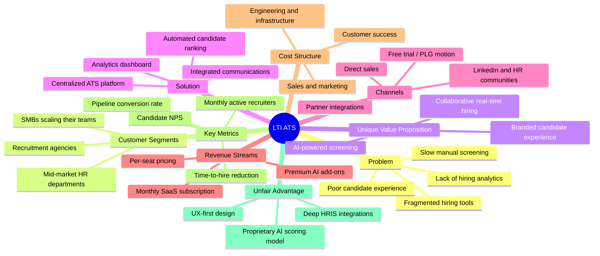
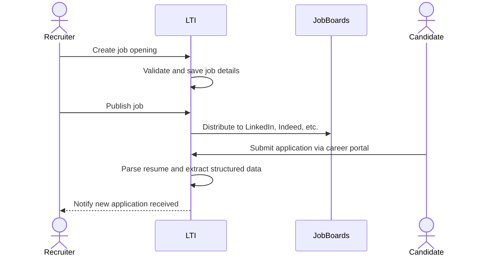
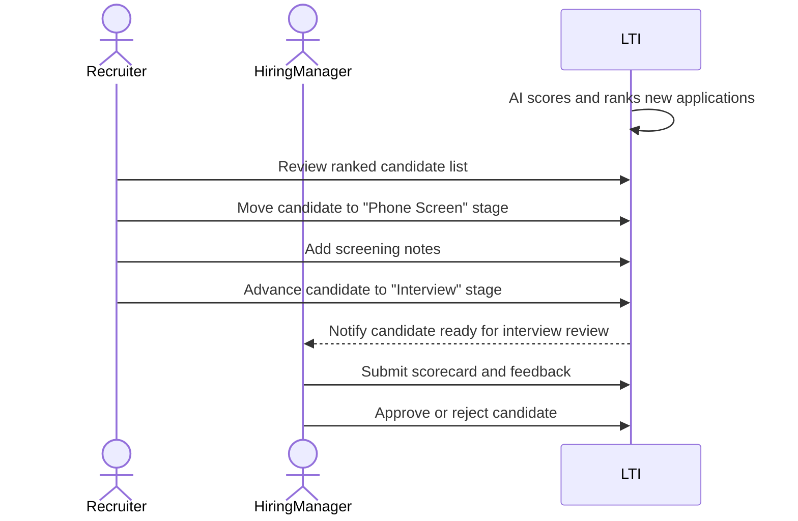
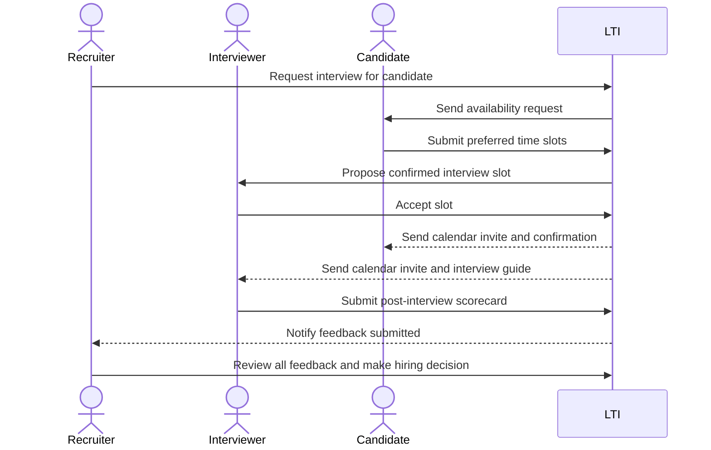
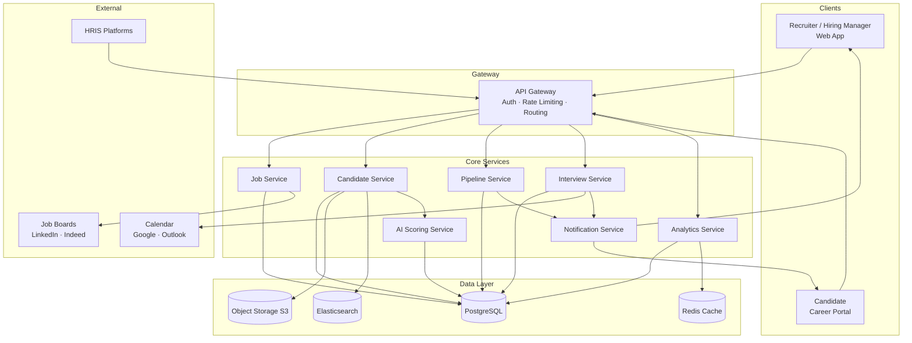
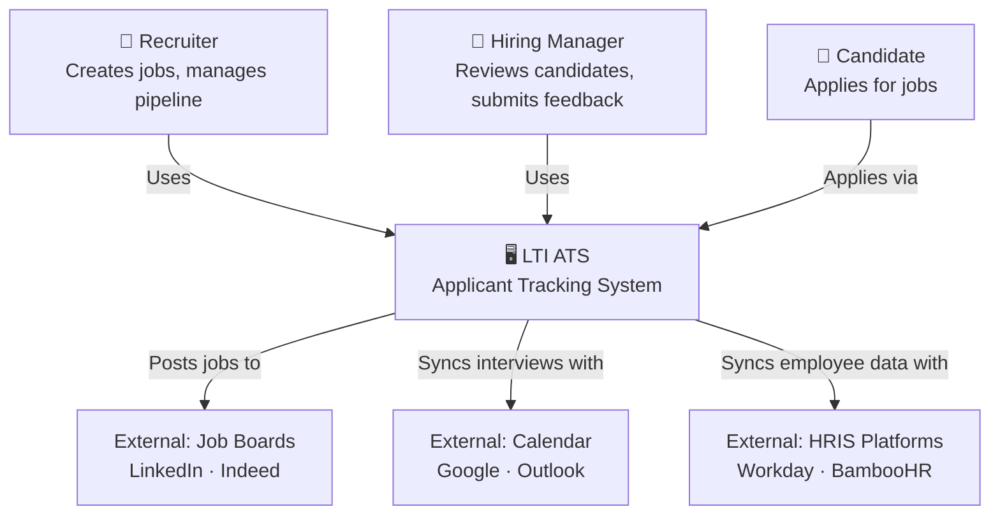
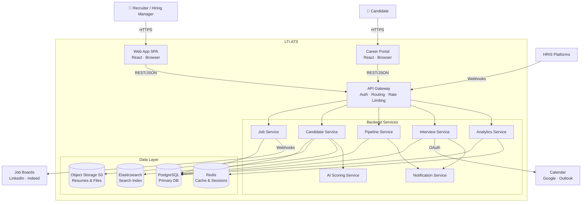
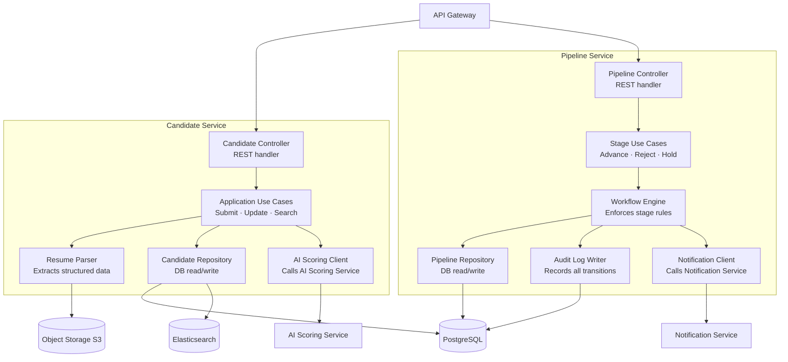

## Description

LTI (Lead Talent Intelligence) is a next-generation Applicant Tracking System designed to streamline the end-to-end recruitment process for companies of all sizes. It centralizes job posting, candidate management, interview coordination, and hiring analytics in a single platform.

**Added value and competitive advantages:**
- **AI-assisted screening** — Automatically ranks and scores candidates based on job fit, reducing manual review time by up to 70%.
- **Collaborative hiring** — Real-time feedback, scorecards, and shared pipelines keep distributed hiring teams aligned without email threads.
- **Unified candidate experience** — A branded career portal and automated communications ensure every applicant receives timely, professional interactions.
- **Data-driven decisions** — Built-in analytics surface bottlenecks, source quality, and time-to-hire metrics so teams can continuously improve.
- **Seamless integrations** — Native connectors to LinkedIn, job boards, HRIS platforms, and calendar tools eliminate duplicate data entry.

**Main functions:**
1. Job posting and multi-channel distribution
2. Candidate application intake and resume parsing
3. Pipeline stage tracking and status management
4. Interview scheduling and feedback collection
5. Reporting and hiring metrics dashboard

---

## Lean Canvas



---

## Main Use Cases

### Use Case 1 — Post a Job and Collect Applications

A recruiter creates a new job opening in LTI, configures the requirements, and publishes it simultaneously to the company career page and external job boards. Candidates apply through a branded portal and their data is automatically parsed and stored.



---

### Use Case 2 — Screen and Advance Candidates Through the Pipeline

The hiring team reviews incoming applications, uses AI scoring to prioritize candidates, moves shortlisted profiles through pipeline stages, and collaborates via scorecards and comments.



---

### Use Case 3 — Schedule Interviews and Collect Structured Feedback

Once a candidate is shortlisted, LTI coordinates interview scheduling between the candidate and interviewers, sends automated reminders, and collects structured feedback post-interview to support the final hiring decision.



---

## High-Level System Design

LTI follows a **modular, service-oriented architecture** deployed on the cloud. The system is split into a frontend layer, a backend API layer, a set of specialized internal services, and a data layer — all communicating via a central API Gateway.

**Key architectural components:**

- **Web Application (SPA)** — React-based frontend consumed by recruiters, hiring managers, and candidates via browser.
- **API Gateway** — Single entry point that handles authentication, rate limiting, and request routing to internal services.
- **Core Services:**
  - *Job Service* — Manages job creation, publication, and distribution to external job boards via webhooks.
  - *Candidate Service* — Handles application intake, resume storage, and candidate profile management.
  - *Pipeline Service* — Tracks stage transitions, enforces workflow rules, and manages audit logs.
  - *Interview Service* — Coordinates scheduling, calendar sync, and reminder notifications.
  - *Notification Service* — Sends emails and in-app alerts triggered by system events.
  - *AI Scoring Service* — Runs candidate-to-job matching models and returns ranked scores asynchronously.
  - *Analytics Service* — Aggregates hiring metrics and serves reporting queries.
- **Data Layer:**
  - *Relational DB (PostgreSQL)* — Source of truth for jobs, candidates, pipelines, and users.
  - *Search Index (Elasticsearch)* — Powers fast candidate and job search queries.
  - *Object Storage (S3)* — Stores raw resumes and attachments.
  - *Cache (Redis)* — Reduces latency for frequently accessed data and session management.
- **External Integrations** — LinkedIn, Indeed, Google/Outlook Calendar, and HRIS platforms connected via outbound webhooks and OAuth flows.



---

## C4 Diagrams

### C4 Level 1 — System Context

This diagram shows LTI as a single system and its relationships with the people and external systems that interact with it. It reveals the three distinct user roles — Recruiter, Hiring Manager, and Candidate — and makes clear that LTI sits at the center of an ecosystem of external job boards, calendar providers, and HRIS platforms. The key architectural decision visible here is that LTI acts as the single integration hub: all external touchpoints flow through it rather than being managed by individual teams in silos.



---

### C4 Level 2 — Containers

This diagram expands LTI into its deployable units, showing how the frontend, API Gateway, backend services, and data stores are structured and how they communicate. It makes visible the key decision to route all traffic through a single API Gateway — centralising authentication, rate limiting, and routing — rather than exposing services directly. It also shows the separation of concerns across services and which data stores each service owns.



---

### C4 Level 3 — Components (Backend: Candidate Service & Pipeline Service)

This diagram decomposes the two most central backend services into their internal components. The **Candidate Service** handles all application intake, resume processing, and AI-assisted scoring coordination; its internal separation between the Resume Parser, Profile Repository, and AI Scoring Client makes the data flow clear. The **Pipeline Service** owns stage transition logic and audit history, and delegates all outbound communication to the Notification Service. The key design decision visible here is that neither service handles concerns outside its bounded context — cross-service calls are narrow and explicit.



---

## Prompts

```
Refine my prompt:

"""
Eres un experto en producto, con experiencia en ATS (Applicant Tracking System).

¿Qué funcionalidades básicas tiene un ATS?

Descríbemelas en un listado en inglés, ordenado de mayor a menor prioridad
"""
```

```
  ## Objective
  List the core functionalities of a modern ATS, prioritized from most to least critical for a baseline product.

  ## Instructions
  1. Consider what features are essential for an ATS to be minimally viable and useful to recruiting teams.
  2. Order the list from highest to lowest priority based on business impact and frequency of use.
  3. For each item, provide a one-sentence description of what the feature does and why it matters.

  ## Constraints
  - Focus on core/basic functionalities only — exclude advanced or enterprise-tier features.
  - Keep descriptions concise (one sentence each).
  - Do not group features into categories; present a single flat ordered list.

  ## Output format
  A numbered list in English, ordered from highest to lowest priority:

  1. **Feature name** — Brief description of what it does and why it's essential.
  2. ...
```

```
we are goind to build an ATS called LTI

let's complete @LTI-DFG/LTI-DFG.md adding a section "Description" at the top, and the second one "Main use cases" which should
hace the 3 main ones 
```

```
we are goind to build an ATS called LTI

let's complete @LTI-DFG/LTI-DFG.md adding two sections at the top:

1 "Description" with: "Descripción breve del software LTI, valor añadido y ventajas competitivas. Explicación de las funciones
principales." 
2. "Lean Canvas": Añadir un diagrama Lean Canvas (en Mermaid con un mindmap) para entender el modelo de negocio", 
3. "Main use cases": "Descripción de los 3 casos de uso principales, con el diagrama en mermeid asociado a cada uno"
```

```
now after the use cases and before the prompts add a new section with:

"""
Diseño del sistema a alto nivel, tanto explicado como diagrama adjunto hecho en mermeid
"""
```

```
refine this prompt

now let's generate the C4 diagrams: context, containers, and components only the backend
```